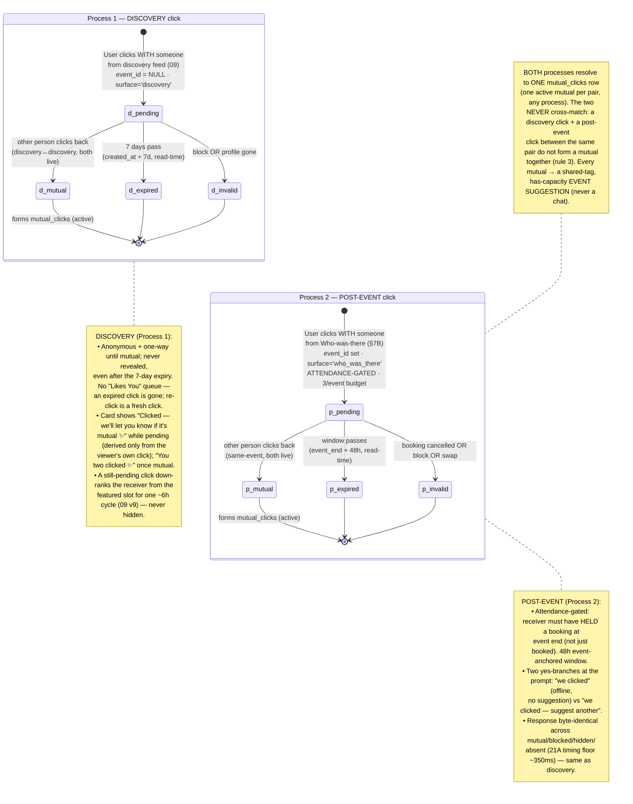
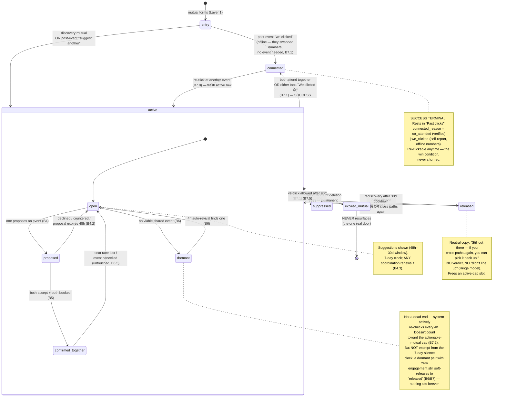
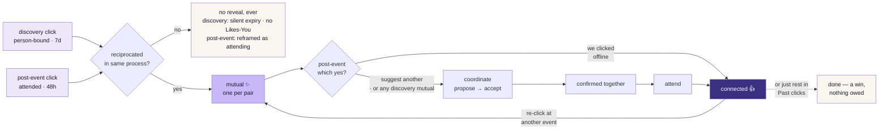

<!-- Last updated: 2026-06-26 | Revision: v5 (dormant note + recovery-branches row clarified — dormant is NOT exempt from the 7-day silence clock, so a zero-engagement dormant pair soft-releases to released and never sits forever (B6/B7.6, already canon in 21 §B6); source-of-truth refs bumped to 21 v10 / 09 v12. No state-model change.) -->

# Click Mechanic — Full Lifecycle Process Map

**Source of truth:** `21_CLICK_MECHANIC.md` (Parts A+B) at revision v10 (+ `09` v12 for discovery + the suggestion-capacity floor). This map is downstream — on any conflict, the spec wins. Regenerate when `21` changes the state model.

**How to read it:** the mechanic has two layers that chain. The **Send layer** (Part A) takes a click to a mutual — and as of June 2026 there are **two parallel send processes** (discovery + post-event). The **Coordination + Lifecycle layer** (Part B) takes a mutual through planning, attendance, and its eventual terminal — with every terminal except `block`/`delete` looping back into a fresh cycle.

---

## Layer 1 — Send layer (Part A): click → mutual — TWO PROCESSES (21 v8)

Pre-event clicking was removed June 2026. A person is clicked either from **discovery** (Process 1, anonymous, person-bound, no event) or **after an event they attended** (Process 2). The event page itself is context-only — no clicking. The two processes never cross-match (rule 3).

---

## Layer 2 — Coordination + Lifecycle (Part B): mutual → terminal → re-click

The mutual is the asset. An event is just the current *attempt* to realise it. A failed attempt never kills the mutual — it returns to a recoverable state.

---

## The infinite cycle (the spine)

The "we clicked (offline)" yes-branch short-circuits straight to `connected` (they swapped numbers — no event needed); every other path — "suggest another," and *all* discovery mutuals — flows through coordination. Both still land at `connected`, the win condition.

---

## State reference (binding — every term maps to one (status, coord_state) pair)

| User sees | `status` | `coord_state` | Re-clickable? | Counts to cap? |
|---|---|---|---|---|
| a live mutual | `active` | `open` / `proposed` / `dormant` | n/a (live) | yes if `open`/`proposed`, **no** if `dormant` |
| a plan / going together | `active` | `confirmed_together` | n/a | no (handled) |
| "We clicked" / connected | `connected` | frozen | yes → new `active` | no (history) |
| released / softly expired | `released` | frozen | yes after 30d | no (history) |
| not feeling it / suppressed | `suppressed` | frozen | yes after 90d | no (history) |
| blocked / deleted | `expired` | frozen | **no, while cause persists** | no (history) |

**Five foolproof invariants** (enforced + sim-tested):
1. Exactly one `active` mutual per pair, ever (partial unique index on `status='active'`).
2. A mutual leaves `active` only via four named exits — `connected` / `released` / `suppressed` / `expired`. No fifth, no stuck state.
3. Three of the four are re-clickable (`connected` / `released` / `suppressed`-after-90d). Only `expired` is a real door.
4. No coordination dead-end: every `coord_state` has an explicit way out; `dormant` is actively revived.
5. The cycle is infinite: connected → re-click → active → confirmed_together → attend → connected → … each lap clean.

---

## Recovery branches (the unhappy paths, all defined)

| Situation | What happens | Spec |
|---|---|---|
| Discovery click not reciprocated (Process 1) | No reveal, ever; the click silently expires at 7d. No "Likes You" queue — it's just gone; re-click anytime is a fresh click. While pending, the receiver isn't walled out of discovery — only down-ranked from the featured slot for ~one cycle | §6.1, `09` v9, `21` v8 §5 |
| Post-event click not reciprocated (Process 2) | No reveal, ever; reframed as *attending*, with an aggregate "getting noticed" warmth signal. Sender's surface shows "Clicked — we'll let you know if it's mutual ✨" (own click only) | §6.1, `06` §2.6, `21` v8 §7B |
| Proposal sent, never answered | Expires to `open` at 48h, both nudged once, mutual untouched; proposer's copy softens after 24h receiver-inactivity | B4.2 |
| Seat race lost to another pair | Neutral "filled up just now" + priority re-suggest + waitlist-together; never strands/blames/reveals | B5.5 |
| No viable event right now | `dormant`, auto-revived every 4h; still under the 7-day silence clock so it can't sit forever → `released` if zero engagement | B6 / B7.6 |
| 7-day silence | Soft-release, neutral no-fault copy, resurfaces via rediscovery | B7.6 / B7.9 |
| Recipient never saw the mutual | Read-time awareness gate → first-open interstitial recovers the missed mutual; never the lie | B7.6a |
| Partner pauses / suspended / deletes / blocks mid-coordination | Survivor sees one neutral line ("That one's run its course…"), snapshot revoked, no ghost proposal | B7.4a-i |
| Overloaded popular user (40+ incoming) | Cap counts *actionable* mutuals (soft 8); down-rank in discovery, never hard-block; calendar spread absorbs load | B7.2 |
